# 0.学习目标

- 了解电商行业
- 了解乐优商城项目结构
- 能独立搭建项目基本框架
- 能参考使用ES6的新语法


# 1.了解电商行业

学习电商项目，自然要先了解这个行业，所以我们首先来聊聊电商行业

## 1.1.项目分类

主要从需求方、盈利模式、技术侧重点这三个方面来看它们的不同

### 1.1.1.传统项目

各种企业里面用的管理系统（ERP、HR、OA、CRM、物流管理系统。。。。。。。）

- 需求方：公司、企业内部
- 盈利模式：项目本身卖钱
- 技术侧重点：业务功能

 

### 1.1.2.互联网项目

门户网站、电商网站：baidu.com、qq.com、taobao.com、jd.com  ...... 

- 需求方：广大用户群体
- 盈利模式：虚拟币、增值服务、广告收益......
- 技术侧重点：网站性能、业务功能


而我们今天要聊的就是互联网项目中的重要角色：电商


## 1.2.电商行业的发展

### 1.2.1.钱景

近年来，中国的电子商务快速发展，交易额连创新高，电子商务在各领域的应用不断拓展和深化、相关服务业蓬勃发展、支撑体系不断健全完善、创新的动力和能力不断增强。电子商务正在与实体经济深度融合，进入规模性发展阶段，对经济社会生活的影响不断增大，正成为我国经济发展的新引擎。

中国电子商务研究中心数据显示，截止到 2012 年底，中国电子商务市场交易规模达 7.85万亿人民币，同比增长 30.83%。其中，B2B 电子商务交易额达 6.25 万亿，同比增长 27%。而 2011 年全年，中国电子商务市场交易额达 6 万亿人民币，同比增长 33%，占 GDP 比重上升到 13%；2012 年，电子商务占 GDP 的比重已经高达 15%。

 	


### 1.2.2.数据

来看看双十一的成交数据：


2016双11开场30分钟，创造**每秒交易峰值17.5万笔**，**每秒**支付峰值**12万笔**的新纪录。菜鸟单日物流订单量超过**4.67亿**，创历史新高。


### 1.2.3.技术特点

从上面的数据我们不仅要看到钱，更要看到背后的技术实力。正是得益于电商行业的高强度并发压力，促使了BAT等巨头们的技术进步。电商行业有些什么特点呢？

- 技术范围广
- 技术新
- 高并发（分布式、静态化技术、缓存技术、异步并发、池化、队列）
- 高可用（集群、负载均衡、限流、降级、熔断）
- 数据量大
- 业务复杂
- 数据安全


## 1.3.常见电商模式

电商行业的一些常见模式：

- B2C：商家对个人，如：亚马逊、当当等
- C2C平台：个人对个人，如：咸鱼、拍拍网、ebay
- B2B平台：商家对商家，如：阿里巴巴、八方资源网等
- O2O：线上和线下结合，如：饿了么、电影票、团购等
- P2P：在线金融，贷款，如：网贷之家、人人聚财等。
- B2C平台：天猫、京东、一号店等


## 1.4.一些专业术语

- SaaS：软件即服务

- SOA：面向服务

- RPC：远程过程调用

- RMI：远程方法调用

- PV：(page view)，即页面浏览量；

  用户每1次对网站中的每个网页访问均被记录1次。用户对同一页面的多次访问，访问量累计

- UV：(unique visitor)，独立访客

  指访问某个站点或点击某条新闻的不同IP地址的人数。在同一天内，uv只记录第一次进入网站的具有独立IP的访问者，在同一天内再次访问该网站则不计数。

- PV与带宽：

  - 计算带宽大小需要关注两个指标：峰值流量和页面的平均大小。
  - 计算公式是：网站带宽= ( PV * 平均页面大小（单位MB）* 8 )/统计时间（换算到秒）
  - 为什么要乘以8？
    - 网站大小为单位是字节(Byte)，而计算带宽的单位是bit，1Byte=8bit
  - 这个计算的是平均带宽，高峰期还需要扩大一定倍数

- PV、QPS、并发

  - QPS：每秒处理的请求数量。8000/s
    - 比如你的程序处理一个请求平均需要0.1S，那么1秒就可以处理10个请求。QPS自然就是10，多线程情况下，这个数字可能就会有所增加。

  - 由PV和QPS如何需要部署的服务器数量？
    - 根据二八原则，80%的请求集中在20%的时间来计算峰值压力：
    - （每日PV * 80%） / （3600s * 24 * 20%） * 每个页面的请求数  = 每个页面每秒的请求数量
    - 然后除以服务器的QPS值，即可计算得出需要部署的服务器数量

    


## 1.5.项目开发流程

项目经理：管人

产品经理：设计需求原型

测试：

前端：大前端。node

后端：

移动端：

项目开发流程图：

​		

公司现状：

​	


# 2.乐优商城介绍

## 2.1.项目介绍

- 乐优商城是一个全品类的电商购物网站（B2C）。
- 用户可以在线购买商品、加入购物车、下单、秒杀商品
- 可以品论已购买商品
- 管理员可以在后台管理商品的上下架、促销活动
- 管理员可以监控商品销售状况
- 客服可以在后台处理退款操作
- 希望未来3到5年可以支持千万用户的使用


## 2.2.系统架构

### 2.2.1.架构图
# node.js : nodejs相当于.net,   jvm 或者 python.   它是一个运行平台, 只不过它运行的是javascript语言而已.   类似地,  .net一般运行C#, vb等编译过后的il.  而jvm一般运行java编译成的字节码,  python一般运行python语言.  #

乐优商城架构缩略图，大图请参考课前资料：

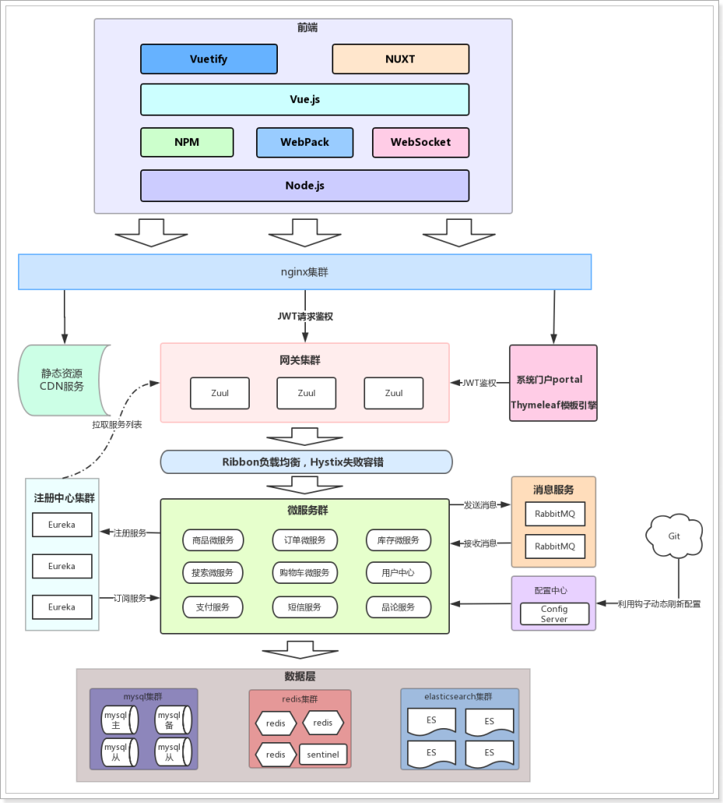


### 2.2.2.系统架构解读

整个乐优商城可以分为两部分：后台管理系统、前台门户系统。

- 后台管理：

  - 后台系统主要包含以下功能：
    - 商品管理，包括商品分类、品牌、商品规格等信息的管理
    - 销售管理，包括订单统计、订单退款处理、促销活动生成等
    - 用户管理，包括用户控制、冻结、解锁等
    - 权限管理，整个网站的权限控制，采用JWT鉴权方案，对用户及API进行权限控制
    - 统计，各种数据的统计分析展示
  - 后台系统会采用前后端分离开发，而且整个后台管理系统会使用Vue.js框架搭建出单页应用（SPA）。
  - 预览图：


  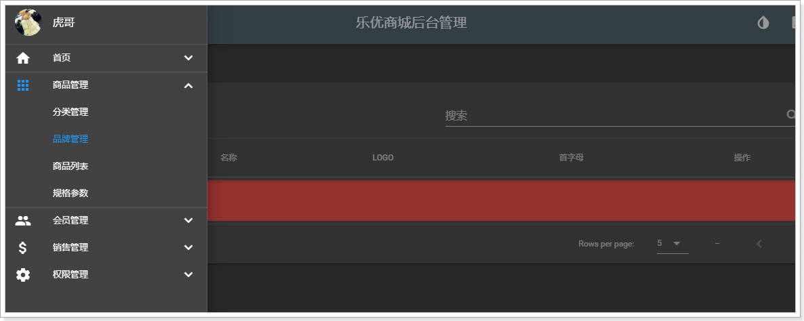

- 前台门户

  - 前台门户面向的是客户，包含与客户交互的一切功能。例如：
    - 搜索商品
    - 加入购物车
    - 下单
    - 评价商品等等
  - 前台系统我们会使用Thymeleaf模板引擎技术来完成页面开发。出于SEO优化的考虑，我们将不采用单页应用。

  


无论是前台还是后台系统，都共享相同的微服务集群，包括：

- 商品微服务：商品及商品分类、品牌、库存等的服务
- 搜索微服务：实现搜索功能
- 订单微服务：实现订单相关
- 购物车微服务：实现购物车相关功能
- 用户中心：用户的登录注册等功能
- Eureka注册中心
- Zuul网关服务
- Spring Cloud Config配置中心
- ...


# 3.项目搭建

## 3.1.技术选型

前端技术：

- 基础的HTML、CSS、JavaScript（基于ES6标准）
- JQuery
- Vue.js 2.0以及基于Vue的框架：Vuetify
- 前端构建工具：WebPack
- 前端安装包工具：NPM
- Vue脚手架：Vue-cli
- Vue路由：vue-router
- ajax框架：axios
- 基于Vue的富文本框架：quill-editor

后端技术：

- 基础的SpringMVC、Spring 5.0和MyBatis3
- Spring Boot 2.0.1版本
- Spring Cloud 最新版 Finchley.RC1
- Redis-4.0
- RabbitMQ-3.4
- Elasticsearch-5.6.8
- nginx-1.10.2：
- FastDFS - 5.0.8
- MyCat
- Thymeleaf

## 3.2.开发环境

为了保证开发环境的统一，希望每个人都按照我的环境来配置：

- IDE：我们使用Idea 2017.3 版本
- JDK：统一使用JDK1.8
- 项目构建：maven3.3.9以上版本即可
- 版本控制工具：git


idea大家可以在我的课前资料中找到。另外，使用帮助大家可以参考课前资料的《idea使用指南.md》


## 3.3.域名

我们在开发的过程中，为了保证以后的生产、测试环境统一。尽量都采用域名来访问项目。

一级域名：www.leyou.com

二级域名：manage.leyou.com , api.leyou.com

我们可以通过switchhost工具来修改自己的host对应的地址，只要把这些域名指向127.0.0.1，那么跟你用localhost的效果是完全一样的。

switchhost可以去课前资料寻找。


## 3.4.创建父工程

创建统一的父工程：leyou，用来管理依赖及其版本，注意是创建project，而不是moudle

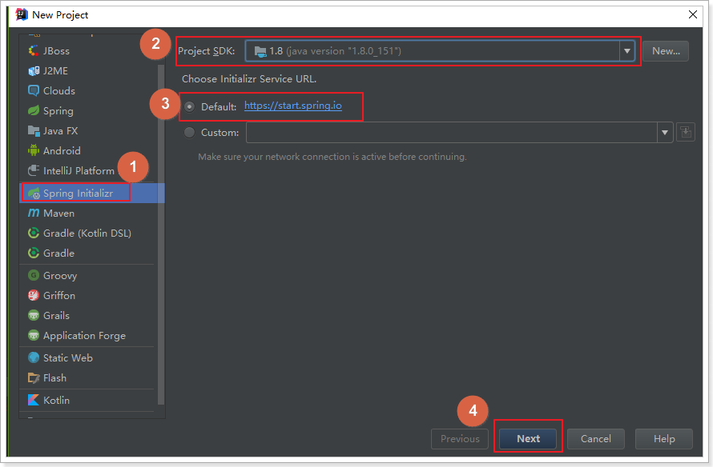

填写项目信息：

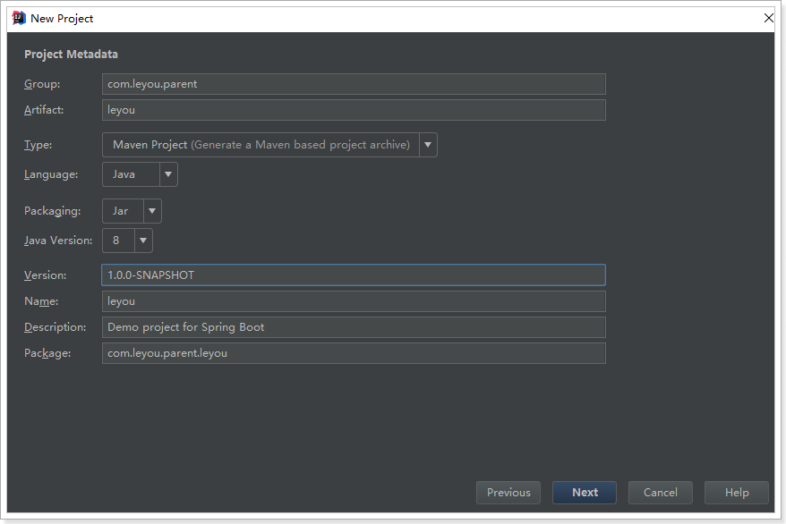

注意：

父工程不需要代码，只是管理依赖，因此我们不选择任何SpringCloud的依赖

跳过依赖选择。


填写保存的位置信息：

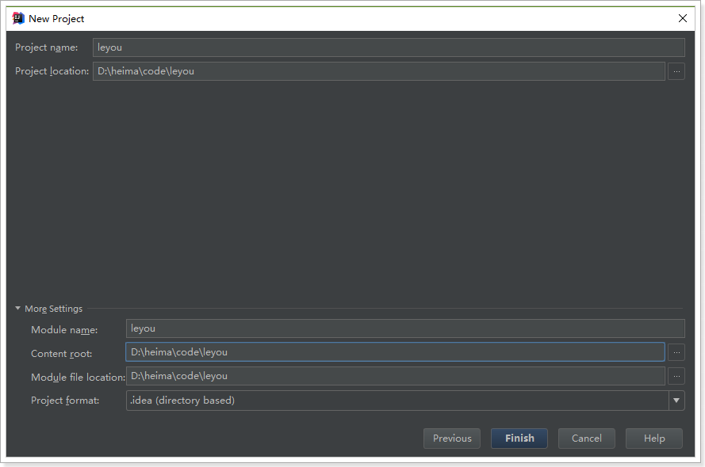

然后将pom文件修改成我这个样子：

```xml


	<modelVersion>4.0.0</modelVersion>

	<groupId>com.leyou.parent</groupId>
	<artifactId>leyou</artifactId>
	<version>1.0.0-SNAPSHOT</version>
	<packaging>pom</packaging>

	<name>leyou</name>
	<description>Demo project for Spring Boot</description>

	<parent>
		<groupId>org.springframework.boot</groupId>
		<artifactId>spring-boot-starter-parent</artifactId>
		<version>2.0.1.RELEASE</version>
		<relativePath/> <!-- lookup parent from repository -->
	</parent>

	<properties>
		<project.build.sourceEncoding>UTF-8</project.build.sourceEncoding>
		<project.reporting.outputEncoding>UTF-8</project.reporting.outputEncoding>
		<java.version>1.8</java.version>
		<spring-cloud.version>Finchley.RC1</spring-cloud.version>
		<mybatis.starter.version>1.3.2</mybatis.starter.version>
		<mapper.starter.version>2.0.2</mapper.starter.version>
		<druid.starter.version>1.1.9</druid.starter.version>
		<mysql.version>5.1.32</mysql.version>
		<pageHelper.starter.version>1.2.3</pageHelper.starter.version>
		<leyou.latest.version>1.0.0-SNAPSHOT</leyou.latest.version>
		<fastDFS.client.version>1.26.1-RELEASE</fastDFS.client.version>
	</properties>

	<dependencyManagement>
		<dependencies>
			<!-- springCloud -->
			<dependency>
				<groupId>org.springframework.cloud</groupId>
				<artifactId>spring-cloud-dependencies</artifactId>
				<version>${spring-cloud.version}</version>
				<type>pom</type>
				<scope>import</scope>
			</dependency>
			<!-- mybatis启动器 -->
			<dependency>
				<groupId>org.mybatis.spring.boot</groupId>
				<artifactId>mybatis-spring-boot-starter</artifactId>
				<version>${mybatis.starter.version}</version>
			</dependency>
			<!-- 通用Mapper启动器 -->
			<dependency>
				<groupId>tk.mybatis</groupId>
				<artifactId>mapper-spring-boot-starter</artifactId>
				<version>${mapper.starter.version}</version>
			</dependency>
			<!-- 分页助手启动器 -->
			<dependency>
				<groupId>com.github.pagehelper</groupId>
				<artifactId>pagehelper-spring-boot-starter</artifactId>
				<version>${pageHelper.starter.version}</version>
			</dependency>
			<!-- mysql驱动 -->
			<dependency>
				<groupId>mysql</groupId>
				<artifactId>mysql-connector-java</artifactId>
				<version>${mysql.version}</version>
			</dependency>
			<!--FastDFS客户端-->
			<dependency>
				<groupId>com.github.tobato</groupId>
				<artifactId>fastdfs-client</artifactId>
				<version>${fastDFS.client.version}</version>
			</dependency>
          </dependencies>
	</dependencyManagement>

	<build>
		<plugins>
			<plugin>
				<groupId>org.springframework.boot</groupId>
				<artifactId>spring-boot-maven-plugin</artifactId>
			</plugin>
		</plugins>
	</build>

	<repositories>
		<repository>
			<id>spring-milestones</id>
			<name>Spring Milestones</name>
			<url>https://repo.spring.io/milestone</url>
			<snapshots>
				<enabled>false</enabled>
			</snapshots>
		</repository>
	</repositories>


```

可以发现，我们在父工程中引入了SpringCloud等很多以后需要用到的依赖，以后创建的子工程就不需要自己引入了。


最后，删除自动生成的LeyouApplication启动类、测试类以及application.properties文件，我们不需要。

## 3.5.创建EurekaServer

### 3.5.1.创建工程

这个大家应该比较熟悉了。

我们的注册中心，起名为：ly-registry

这次我们就不Spring使用提供的脚手架了。直接创建maven项目，自然会继承父类的依赖：

选择新建module：

​	

选择maven安装，但是不要选择骨架：


然后填写项目坐标，我们的项目名称为ly-registry:


选择安装目录，因为是聚合项目，目录应该是在父工程leyou的下面：


### 3.5.2.添加依赖

添加EurekaServer的依赖：

```xml

    <parent>
        <artifactId>leyou</artifactId>
        <groupId>com.leyou.parent</groupId>
        <version>1.0.0-SNAPSHOT</version>
    </parent>
    <modelVersion>4.0.0</modelVersion>

    <groupId>com.leyou.common</groupId>
    <artifactId>ly-registry</artifactId>
    <version>1.0.0-SNAPSHOT</version>

    <dependencies>
        <dependency>
            <groupId>org.springframework.cloud</groupId>
            <artifactId>spring-cloud-starter-netflix-eureka-server</artifactId>
        </dependency>
    </dependencies>

```

### 3.5.3.编写启动类

```java
@SpringBootApplication
@EnableEurekaServer
public class LyRegistry {
    public static void main(String[] args) {
        SpringApplication.run(LyRegistry.class, args);
    }
}
```

### 3.5.4.配置文件

```yaml
server:
  port: 10086
spring:
  application:
    name: ly-registry
eureka:
  client:
    fetch-registry: false
    register-with-eureka: false
    service-url:
      defaultZone: http://127.0.0.1:${server.port}/eureka
  server:
    enable-self-preservation: false # 关闭自我保护
    eviction-interval-timer-in-ms: 5000 # 每隔5秒进行一次服务列表清理
```

### 3.5.5.项目的结构：

目前，整个项目的结构如图：

 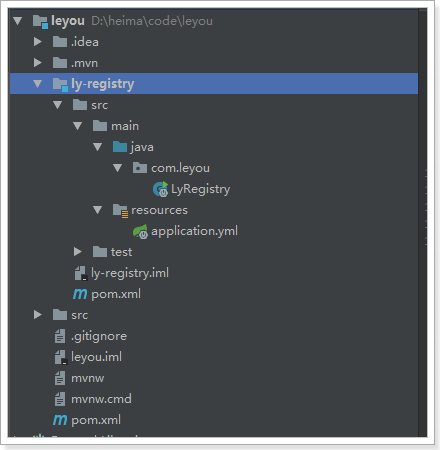


## 3.6.创建Zuul网关

### 3.6.1.创建工程

与上面类似，选择maven方式创建Module，然后填写项目名称，我们命名为：ly-api-gateway


填写保存的目录：

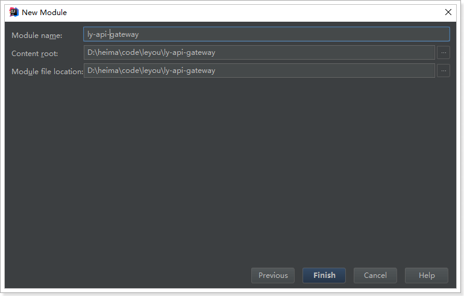

### 3.6.2.添加依赖

这里我们需要添加Zuul和EurekaClient的依赖：

```xml
<?xml version="1.0" encoding="UTF-8"?>

    <parent>
        <artifactId>leyou</artifactId>
        <groupId>com.leyou.parent</groupId>
        <version>1.0.0-SNAPSHOT</version>
    </parent>
    <modelVersion>4.0.0</modelVersion>

    <groupId>com.leyou.common</groupId>
    <artifactId>ly-api-gateway</artifactId>
    <version>1.0.0-SNAPSHOT</version>

    <dependencies>
        <dependency>
            <groupId>org.springframework.cloud</groupId>
            <artifactId>spring-cloud-starter-netflix-zuul</artifactId>
        </dependency>
        <dependency>
            <groupId>org.springframework.cloud</groupId>
            <artifactId>spring-cloud-starter-netflix-eureka-client</artifactId>
        </dependency>
        <!--是springboot提供的微服务检测接口，默认对外提供几个接口：/info-->
        <dependency>
            <groupId>org.springframework.boot</groupId>
            <artifactId>spring-boot-starter-actuator</artifactId>
        </dependency>
    </dependencies>

```

### 3.6.3.编写启动类

```java
@SpringBootApplication
@EnableDiscoveryClient
@EnableZuulProxy
public class LyApiGateway {
    public static void main(String[] args) {
        SpringApplication.run(LyApiGateway.class, args);
    }
}
```


### 3.6.4.配置文件

```yaml
server:
  port: 10010
spring:
  application:
    name: api-gateway
eureka:
  client:
    service-url:
      defaultZone: http://127.0.0.1:10086/eureka
    registry-fetch-interval-seconds: 5
  instance:
    prefer-ip-address: true
    ip-address: 127.0.0.1
    instance-id: ${spring.application.name}:${server.port}
zuul:
  prefix: /api # 添加路由前缀
  retryable: true
ribbon:
  ConnectTimeout: 250 # 连接超时时间(ms)
  ReadTimeout: 2000 # 通信超时时间(ms)
  OkToRetryOnAllOperations: true # 是否对所有操作重试
  MaxAutoRetriesNextServer: 1 # 同一服务不同实例的重试次数
  MaxAutoRetries: 1 # 同一实例的重试次数
hystrix:
  command:
    default:
      execution:
        isolation:
          thread:
            timeoutInMillisecond: 10000 # 熔断超时时长：10000ms
```

### 3.6.5.项目结构

目前，leyou下有两个子模块：

- ly-registry：服务的注册中心（EurekaServer）
- ly-api-gateway：服务网关（Zuul）

目前，服务的结构如图所示：

 	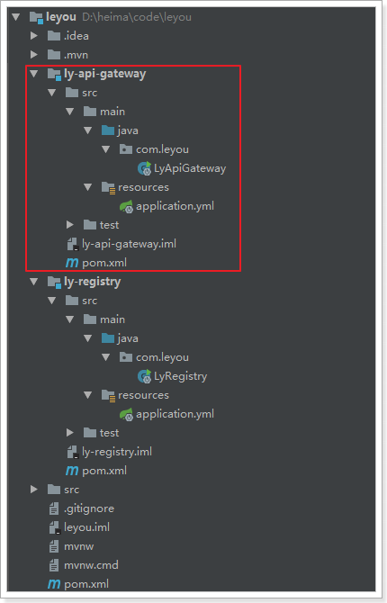


截止到这里，我们已经把基础服务搭建完毕，为了便于开发，统一配置中心（ConfigServer）我们留待以后添加。


## 3.7.创建商品微服务

既然是一个全品类的电商购物平台，那么核心自然就是商品。因此我们要搭建的第一个服务，就是商品微服务。其中会包含对于商品相关的一系列内容的管理，包括：

- 商品分类管理
- 品牌管理
- 商品规格参数管理
- 商品管理
- 库存管理

我们先完成项目的搭建：

### 3.7.1.微服务的结构

因为与商品的品类相关，我们的工程命名为`ly-item`.

需要注意的是，我们的ly-item是一个微服务，那么将来肯定会有其它系统需要来调用服务中提供的接口，因此肯定也会使用到接口中关联的实体类。

因此这里我们需要使用聚合工程，将要提供的接口及相关实体类放到独立子工程中，以后别人引用的时候，只需要知道坐标即可。

我们会在ly-item中创建两个子工程：

- ly-item-interface：主要是对外暴露的接口及相关实体类
- ly-item-service：所有业务逻辑及内部使用接口

调用关系如图所示：


### 3.7.2.创建父工程ly-item

依然是使用maven构建：


保存的位置：


不需要任何依赖，我们可以把项目打包方式设置为pom

```xml
<?xml version="1.0" encoding="UTF-8"?>

    <parent>
        <artifactId>leyou</artifactId>
        <groupId>com.leyou.parent</groupId>
        <version>1.0.0-SNAPSHOT</version>
    </parent>
    <modelVersion>4.0.0</modelVersion>

    <groupId>com.leyou.service</groupId>
    <artifactId>ly-item</artifactId>
    <version>1.0.0-SNAPSHOT</version>
    <!-- 打包方式为pom -->
    <packaging>pom</packaging>

```


### 3.7.3.创建ly-item-interface

在ly-item工程上点击右键，选择new > module:

 

依然是使用maven构建，注意父工程是ly-item：

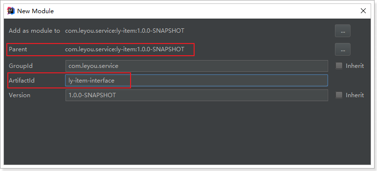

**注意**：接下来填写的目录结构需要自己手动完成，保存到`ly-item`下的`ly-item-interface`目录中：

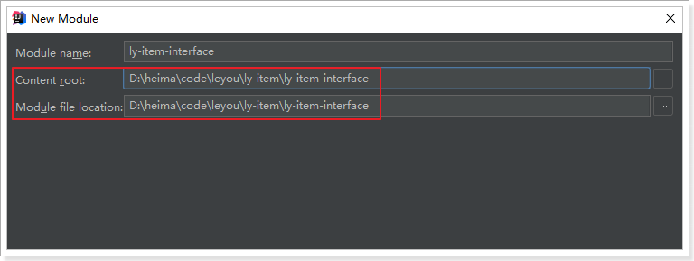

点击Finish完成。

此时的项目结构：

​	

### 3.7.4.创建ly-item-service

与`ly-item-interface`类似，我们选择在`ly-item`上右键，新建module，然后填写项目信息：


填写存储位置，是在`/ly-item/ly-item-service`目录


点击Finish完成。

### 3.7.5.整个微服务结构

如图所示：

​	

我们打开ly-item的pom查看，会发现ly-item-interface和ly-item-service都已经称为module了：

​	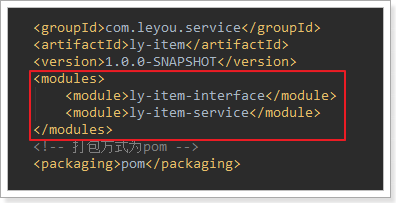

### 3.7.6.添加依赖

接下来我们给`ly-item-service`中添加依赖：

思考一下我们需要什么？

- Eureka客户端
- web启动器
- mybatis启动器
- 通用mapper启动器
- 分页助手启动器
- 连接池，我们用默认的Hykira
- mysql驱动
- 千万不能忘了，我们自己也需要`ly-item-interface`中的实体类

这些依赖，我们在顶级父工程：leyou中已经添加好了。所以直接引入即可：

```xml
<?xml version="1.0" encoding="UTF-8"?>

    <parent>
        <artifactId>ly-item</artifactId>
        <groupId>com.leyou.service</groupId>
        <version>1.0.0-SNAPSHOT</version>
    </parent>
    <modelVersion>4.0.0</modelVersion>

    <groupId>com.leyou.service</groupId>
    <artifactId>ly-item-service</artifactId>
    <version>1.0.0-SNAPSHOT</version>

    <dependencies>
        <!--Eureka客户端-->
        <dependency>
            <groupId>org.springframework.cloud</groupId>
            <artifactId>spring-cloud-starter-netflix-eureka-client</artifactId>
        </dependency>
        <!--web启动器-->
        <dependency>
            <groupId>org.springframework.boot</groupId>
            <artifactId>spring-boot-starter-web</artifactId>
        </dependency>
        <!-- mybatis启动器 -->
        <dependency>
            <groupId>org.mybatis.spring.boot</groupId>
            <artifactId>mybatis-spring-boot-starter</artifactId>
            <version>${mybatis.starter.version}</version>
        </dependency>
        <!-- 通用Mapper启动器 -->
        <dependency>
            <groupId>tk.mybatis</groupId>
            <artifactId>mapper-spring-boot-starter</artifactId>
            <version>${mapper.starter.version}</version>
        </dependency>
        <!-- 分页助手启动器 -->
        <dependency>
            <groupId>com.github.pagehelper</groupId>
            <artifactId>pagehelper-spring-boot-starter</artifactId>
            <version>${pageHelper.starter.version}</version>
        </dependency>
        <!-- mysql驱动 -->
        <dependency>
            <groupId>mysql</groupId>
            <artifactId>mysql-connector-java</artifactId>
            <version>${mysql.version}</version>
        </dependency>
        <dependency>
            <groupId>com.leyou.service</groupId>
            <artifactId>ly-item-interface</artifactId>
            <version>${leyou.latest.version}</version>
        </dependency>
        <dependency>
            <groupId>org.springframework.boot</groupId>
            <artifactId>spring-boot-starter-actuator</artifactId>
        </dependency>
    </dependencies>

```


ly-item-interface中需要什么我们暂时不清楚，所以先不管。

整个结构：

 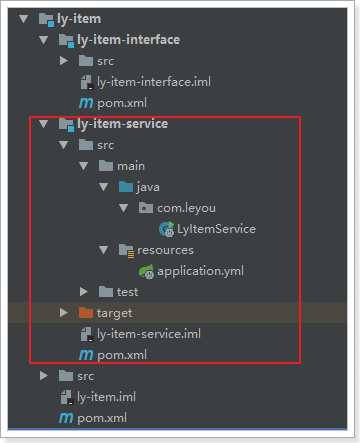


### 3.7.7.编写启动和配置

在整个`ly-item工程`中，只有`ly-item-service`是需要启动的。因此在其中编写启动类即可：

```java
@SpringBootApplication
@EnableDiscoveryClient
public class LyItemService {
    public static void main(String[] args) {
        SpringApplication.run(LyItemService.class, args);
    }
}

```


然后是全局属性文件：

```yaml
server:
  port: 8081
spring:
  application:
    name: item-service
  datasource:
    url: jdbc:mysql://localhost:3306/heima
    username: root
    password: 123
    hikari:
      maximum-pool-size: 30
      minimum-idle: 10
eureka:
  client:
    service-url:
      defaultZone: http://127.0.0.1:10086/eureka
  instance:
    lease-renewal-interval-in-seconds: 5 # 每隔5秒发送一次心跳
    lease-expiration-duration-in-seconds: 10 # 10秒不发送就过期
    prefer-ip-address: true
    ip-address: 127.0.0.1
    instance-id: ${spring.application.name}:${server.port}
```


## 3.8.添加商品微服务的路由规则

既然商品微服务已经创建，接下来肯定要添加路由规则到Zuul中，我们不使用默认的路由规则。

```yaml
zuul:
  prefix: /api # 添加路由前缀
  retryable: true
  routes:
    item-service: /item/** # 将商品微服务映射到/item/**
```


## 3.9.启动测试

我们分别启动：ly-registry，ly-api-gateway，ly-item-service

 

查看Eureka面板：


## 3.10.测试路由规则

为了测试路由规则是否畅通，我们是不是需要在item-service中编写一个controller接口呢？

其实不需要，Spring提供了一个依赖：actuator

只要我们添加了actuator的依赖，它就会为我们生成一系列的访问接口：

- /info
- /health
- /refresh
- ...

添加依赖：

```xml
<dependency>
    <groupId>org.springframework.boot</groupId>
    <artifactId>spring-boot-starter-actuator</artifactId>
</dependency>
```

重启后访问Eureka控制台：

鼠标悬停在item-service上，会显示一个地址：

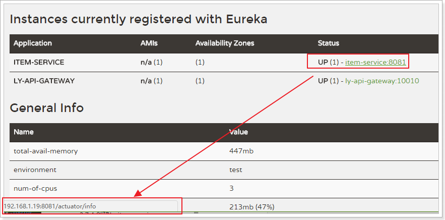

这就是actuator提供的接口，我们点击访问：

 

因为我们没有添加信息，所以是一个空的json，但是可以肯定的是：我们能够访问到item-service了。

接下来我们通过路由访问试试，根据路由规则，我们需要访问的地址是：

http://127.0.0.1:10010/api/item/actuator/info

 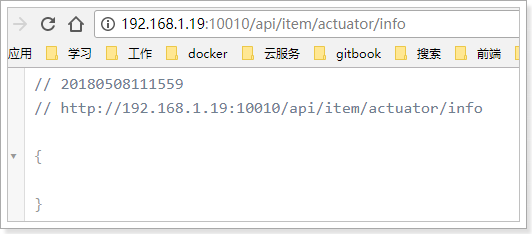


## 3.11.通用工具模块

有些工具或通用的约定内容，我们希望各个服务共享，因此需要创建一个工具模块：`ly-common`


使用maven来构建module：


位置信息：


结构：

 

目前还不需要编码。


# 4、ES6 语法指南

后端项目搭建完毕，接下来就是前端页面了。不过在这之前需要一些准备工作。我们需要学习ES6的语法标准。

什么是ES6？就是ECMAScript第6版标准。

## 4.1.什么是ECMAScript？

来看下前端的发展历程：

> web1.0时代：

- 最初的网页以HTML为主，是纯静态的网页。网页是只读的，信息流只能从服务的到客户端单向流通。**开发人员也只关心页面的样式和内容**即可。

> web2.0时代：

- 1995年，网景工程师Brendan Eich 花了10天时间设计了JavaScript语言。
- 1996年，微软发布了JScript，其实是JavaScript的逆向工程实现。
- 1997年，为了统一各种不同script脚本语言，ECMA（欧洲计算机制造商协会）以JavaScript为基础，制定了`ECMAscript`标准规范。JavaScript和JScript都是`ECMAScript`的标准实现者，随后各大浏览器厂商纷纷实现了`ECMAScript`标准。

所以，ECMAScript是浏览器脚本语言的规范，而各种我们熟知的js语言，如JavaScript则是规范的具体实现。

## 4.2.ECMAScript的快速发展

而后，ECMAScript就进入了快速发展期。

- 1998年6月，ECMAScript 2.0 发布。

- 1999年12月，ECMAScript 3.0 发布。这时，ECMAScript 规范本身也相对比较完善和稳定了，但是接下来的事情，就比较悲剧了。

- 2007年10月。。。。ECMAScript 4.0 草案发布。

  这次的新规范，历时颇久，规范的新内容也有了很多争议。在制定ES4的时候，是分成了两个工作组同时工作的。

  - 一边是以 Adobe, Mozilla, Opera 和 Google为主的 ECMAScript 4 工作组。
  - 一边是以 Microsoft 和 Yahoo 为主的 ECMAScript 3.1 工作组。

  ECMAScript 4 的很多主张比较激进，改动较大。而 ECMAScript 3.1 则主张小幅更新。最终经过 TC39 的会议，决定将一部分不那么激进的改动保留发布为 ECMAScript 3.1，而ES4的内容，则延续到了后来的ECMAScript5和6版本中

- 2009年12月，ECMAScript 5 发布。

- 2011年6月，ECMAScript 5.1 发布。

- 2015年6月，ECMAScript 6，也就是 ECMAScript 2015 发布了。 并且从 ECMAScript 6 开始，开始采用年号来做版本。即 ECMAScript 2015，就是ECMAScript6。 


## 4.3.ES5和6的一些新特性

我们这里只把一些常用的进行学习，更详细的大家参考：[阮一峰的ES6教程](http://es6.ruanyifeng.com/?search=reduce&x=0&y=0#README)

### 4.3.1.let 和 const 命令

> var

之前，js定义变量只有一个关键字：`var`

`var`有一个问题，就是定义的变量有时会莫名奇妙的成为全局变量。

例如这样的一段代码：

```js
for(var i = 0; i < 5; i++){
    console.log(i);
}
console.log("循环外：" + i)
```

你猜下打印的结果是什么？

 


> let

`let`所声明的变量，只在`let`命令所在的代码块内有效。

我们把刚才的`var`改成`let`试试：

```js
for(let i = 0; i < 5; i++){
    console.log(i);
}
console.log("循环外：" + i)
```

结果：

 

> const

`const`声明的变量是常量，不能被修改

 


### 4.3.2.字符串扩展

> 新的API

ES6为字符串扩展了几个新的API：

- `includes()`：返回布尔值，表示是否找到了参数字符串。
- `startsWith()`：返回布尔值，表示参数字符串是否在原字符串的头部。
- `endsWith()`：返回布尔值，表示参数字符串是否在原字符串的尾部。

实验一下：

 


> 字符串模板

ES6中提供了`来作为字符串模板标记。我们可以这么玩：

 

在两个`之间的部分都会被作为字符串的值，不管你任意换行，甚至加入js脚本

键盘是的1的左侧，tab的上侧，esc的正下方

### 4.3.3.解构表达式

> 数组解构

比如有一个数组：

```js
let arr = [1,2,3]
```

我想获取其中的值，只能通过角标。ES6可以这样：

```js
const [x,y,z] = arr;// x，y，z将与arr中的每个位置对应来取值
// 然后打印
console.log(x,y,z);
```

结果：

 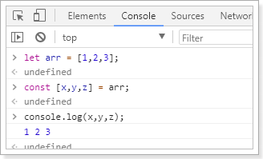


> 对象解构

例如有个person对象：

```js
const person = {
    name:"jack",
    age:21,
    language: ['java','js','css']
}
```

我们可以这么做：

```js
// 解构表达式获取值
const {name,age,language} = person;
// 打印
console.log(name);
console.log(age);
console.log(language);
```

结果：

 


如过想要用其它变量接收，需要额外指定别名：

 

- `{name:n}`：name是person中的属性名，冒号后面的n是解构后要赋值给的变量。


### 4.3.4.函数优化

> 函数参数默认值

在ES6以前，我们无法给一个函数参数设置默认值，只能采用变通写法：

```js
    function add(a , b) {
        // 判断b是否为空，为空就给默认值1
        b = b || 1;
        return a + b;
    }
    // 传一个参数
    console.log(add(10));
```

现在可以这么写：

```js
function add(a , b = 1) {
    return a + b;
}
// 传一个参数
console.log(add(10));
```


> 箭头函数

ES6中定义函数的简写方式：

一个参数时：

```js
var print = function (obj) {
    console.log(obj);
}
// 简写为：
var print2 = obj => console.log(obj);
```

多个参数：

```js
// 两个参数的情况：
var sum = function (a , b) {
    return a + b;
}
// 简写为：
var sum2 = (a,b) => a+b;
```

代码不止一行，可以用`{}`括起来

```js
var sum3 = (a,b) => {
    return a + b;
}
```


> 对象的函数属性简写

比如一个Person对象，里面有eat方法：

```js
let person = {
    name: "jack",
    // 以前：
    eat: function (food) {
        console.log(this.name + "在吃" + food);
    },
    // 箭头函数版：
    eat2: food => console.log(person.name + "在吃" + food),// 这里拿不到this
    // 简写版：
    eat3(food){
        console.log(this.name + "在吃" + food);
    }
}
```


> 箭头函数结合解构表达式

比如有一个函数：

```js
const person = {
    name:"jack",
    age:21,
    language: ['java','js','css']
}

function hello(person) {
    console.log("hello," + person.name)
}
```

如果用箭头函数和解构表达式

```js
var hi = ({name}) =>  console.log("hello," + name);
```

### 4.3.5.map和reduce

数组中新增了map和reduce方法。

> map


`map()`：接收一个函数，将原数组中的所有元素用这个函数处理后放入新数组返回。

举例：有一个字符串数组，我们希望转为int数组

```js
let arr = ['1','20','-5','3'];
console.log(arr)

arr = arr.map(s => parseInt(s));

console.log(arr)
```

  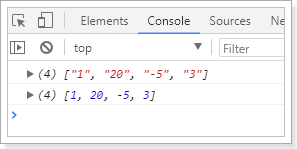


> reduce

`reduce()`：接收一个函数（必须）和一个初始值（可选），该函数接收两个参数：

- 第一个参数是上一次reduce处理的结果
- 第二个参数是数组中要处理的下一个元素

`reduce()`会从左到右依次把数组中的元素用reduce处理，并把处理的结果作为下次reduce的第一个参数。如果是第一次，会把前两个元素作为计算参数，或者把用户指定的初始值作为起始参数

举例：

```
const arr = [1,20,-5,3]
```

没有初始值：

 

指定初始值：

 

### 4.3.6.promise

所谓Promise，简单说就是一个容器，里面保存着某个未来才会结束的事件（通常是一个异步操作）的结果。从语法上说，Promise 是一个对象，从它可以获取异步操作的消息。Promise 提供统一的 API，各种异步操作都可以用同样的方法进行处理。

感觉跟java的Future类很像啊，有木有！

我们可以通过Promise的构造函数来创建Promise对象，并在内部封装一个异步执行的结果。

语法：

```js
const promise = new Promise(function(resolve, reject) {
  // ... 执行异步操作

  if (/* 异步操作成功 */){
    resolve(value);// 调用resolve，代表Promise将返回成功的结果
  } else {
    reject(error);// 调用reject，代表Promise会返回失败结果
  }
});
```

这样，在promise中就封装了一段异步执行的结果。


如果我们想要等待异步执行完成，做一些事情，我们可以通过promise的then方法来实现,语法：

```js
promise.then(function(value){
    // 异步执行成功后的回调
});
```

如果想要处理promise异步执行失败的事件，还可以跟上catch：

```js
promise.then(function(value){
    // 异步执行成功后的回调
}).catch(function(error){
    // 异步执行失败后的回调
})
```

示例：

```
const p = new Promise(function (resolve, reject) {
    // 这里我们用定时任务模拟异步
    setTimeout(() => {
        const num = Math.random();
        // 随机返回成功或失败
        if (num < 0.5) {
            resolve("成功！num:" + num)
        } else {
            reject("出错了！num:" + num)
        }
    }, 300)
})

// 调用promise
p.then(function (msg) {
    console.log(msg);
}).catch(function (msg) {
    console.log(msg);
})
```

结果：

 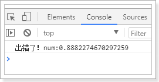

 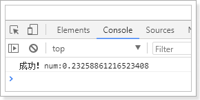

### 4.3.7.set和map（了解）

ES6提供了Set和Map的数据结构。

Set，本质与数组类似。不同在于Set中只能保存不同元素，如果元素相同会被忽略。跟java很像吧。

构造函数：

```js
// Set构造函数可以接收一个数组或空
let set = new Set();
set.add(1);// [1]
// 接收数组
let set2 = new Set([2,3,4,5,5]);// 得到[2,3,4,5]
```

普通方法：

```
set.add(1);// 添加
set.clear();// 清空
set.delete(2);// 删除指定元素
set.has(2); // 判断是否存在
set.keys();// 返回所有key
set.values();// 返回所有值
set.entries();// 返回键值对集合
// 因为set没有键值对，所有其keys、values、entries方法返回值一样的。
set.size; // 元素个数。是属性，不是方法。
```


map，本质是与Object类似的结构。不同在于，Object强制规定key只能是字符串。而Map结构的key可以是任意对象。即：

- object是 <string,object>集合
- map是<object,object>集合

构造函数：

```js
// map接收一个数组，数组中的元素是键值对数组
const map = new Map([
    ['key1','value1'],
    ['key2','value2'],
])
// 或者接收一个set
const set = new Set([
    ['key1','value1'],
    ['key2','value2'],
])
const map2 = new Map(set)
// 或者其它map
const map3 = new Map(map);
```

方法：

 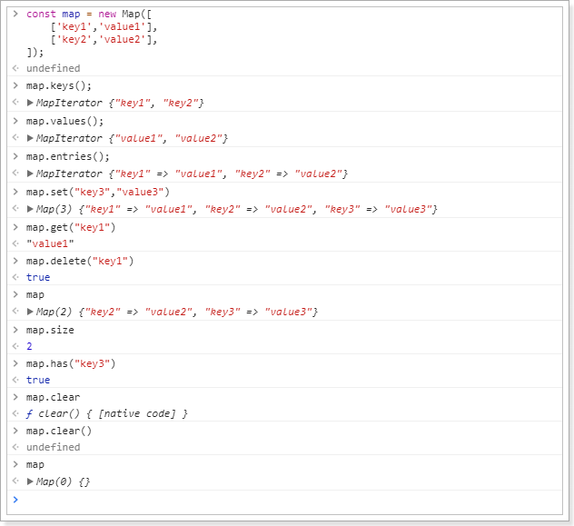

### 4.3.8.模块化

#### 4.3.8.1.什么是模块化

模块化就是把代码进行拆分，方便重复利用。类似java中的导包：要使用一个包，必须先导包。

而JS中没有包的概念，换来的是 模块。

模块功能主要由两个命令构成：`export`和`import`。

- `export`命令用于规定模块的对外接口，
- `import`命令用于导入其他模块提供的功能。


#### 4.3.8.2.export

比如我定义一个js文件:hello.js，里面有一个对象：

```js
const util = {
    sum(a,b){
        return a + b;
    }
}
```

我可以使用export将这个对象导出：

```js
const util = {
    sum(a,b){
        return a + b;
    }
}
export util;
```

当然，也可以简写为：

```js
export const util = {
    sum(a,b){
        return a + b;
    }
}
```

`export`不仅可以导出对象，一切JS变量都可以导出。比如：基本类型变量、函数、数组、对象。

当要导出多个值时，还可以简写。比如我有一个文件：user.js：

```js
var name = "jack"
var age = 21
export {name,age}
```


> 省略名称

上面的导出代码中，都明确指定了导出的变量名，这样其它人在导入使用时就必须准确写出变量名，否则就会出错。

因此js提供了`default`关键字，可以对导出的变量名进行省略

例如：

```js
// 无需声明对象的名字
export default {
	sum(a,b){
        return a + b;
    }
}
```

这样，当使用者导入时，可以任意起名字


#### 4.3.8.3.import

使用`export`命令定义了模块的对外接口以后，其他 JS 文件就可以通过`import`命令加载这个模块。

例如我要使用上面导出的util：

```js
// 导入util
import util from 'hello.js'
// 调用util中的属性
util.sum(1,2)
```


要批量导入前面导出的name和age： 

```js
import {name, age} from 'user.js'

console.log(name + " , 今年"+ age +"岁了")
```


但是上面的代码暂时无法测试，因为浏览器目前还不支持ES6 的导入和导出功能。除非借助于工具，把ES6 的语法进行编译降级到ES5，比如`Babel-cli`工具

 我们暂时不做测试，大家了解即可。


### 4.3.9.对象扩展

ES6给Object拓展了许多新的方法，如：

- keys(obj)：获取对象的所有key形成的数组
- values(obj)：获取对象的所有value形成的数组
- entries(obj)：获取对象的所有key和value形成的二维数组。格式：`[[k1,v1],[k2,v2],...]`
- assian(dest, ...src) ：将多个src对象的值 拷贝到 dest中（浅拷贝）。

 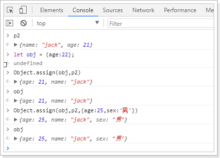


### 4.3.10.数组扩展

ES6给数组新增了许多方法：

- find(callback)：把数组中的元素逐个传递给函数callback执行，如果返回true，则返回该元素
- findIndex(callback)：与find类似，不过返回的是品牌到的元素的索引
- includes（callback）：与find类似，如果匹配到元素，则返回true，代表找到了。